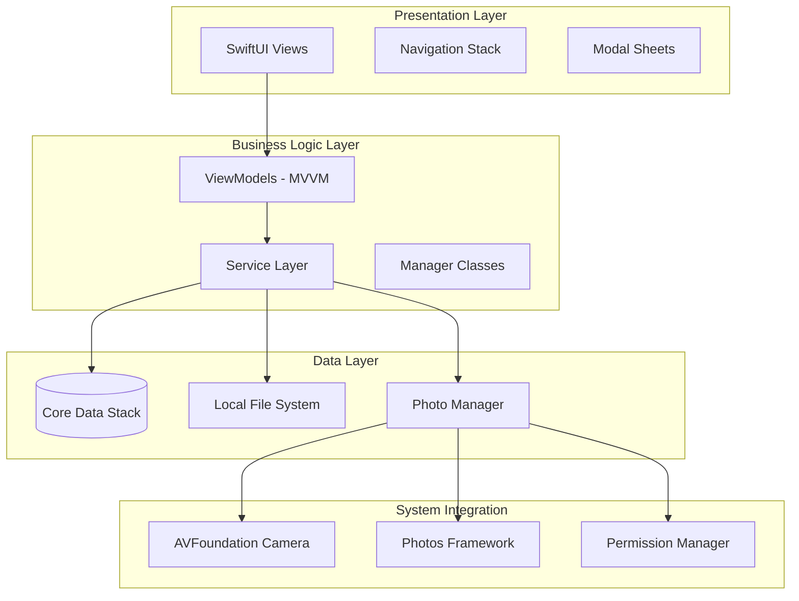
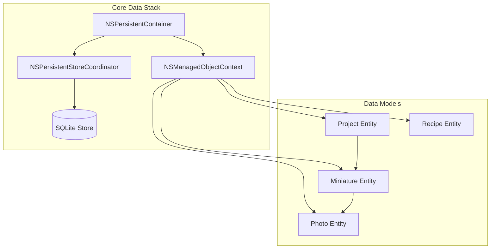
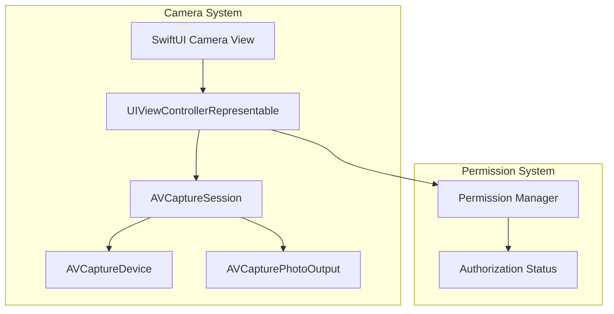

# Design Document: iOS Miniature Painting Tracker

## Overview

The iOS Miniature Painting Tracker is a native mobile application built with Swift and SwiftUI that provides comprehensive offline tracking for Warhammer miniature painting projects. The app follows iOS design principles and leverages Core Data for local persistence, AVFoundation for camera integration, and the Photos framework for photo library access. The architecture emphasizes offline-first functionality, data integrity, and seamless user experience while maintaining compatibility with iOS Human Interface Guidelines.

The system operates entirely without network connectivity, storing all data locally on the device with robust export capabilities for data portability. The app supports the same core functionality as the web application but adapts the interface and workflows for mobile-first interaction patterns.

## Architecture

### High-Level Architecture



### MVVM Architecture Pattern

The app follows the Model-View-ViewModel (MVVM) architectural pattern, which provides clear separation of concerns and enhances testability:

**Model Layer:**
- Core Data entities representing domain objects
- Data transfer objects for export functionality
- Business logic encapsulated in model extensions

**View Layer:**
- SwiftUI views for user interface
- View modifiers for reusable UI components
- Navigation and presentation logic

**ViewModel Layer:**
- ObservableObject classes managing view state
- Business logic coordination
- Data transformation for presentation
- User interaction handling

### Core Data Stack



**Core Data Configuration:**
- Single persistent container with SQLite store
- Main context for UI operations
- Background context for data import/export operations
- Automatic lightweight migration support
- Cascade delete relationships for data integrity

## Components and Interfaces

### View Components

**Primary Views:**
- `ProjectListView`: Displays projects organized by game system with search and filtering
- `ProjectDetailView`: Shows miniatures within a project with progress overview
- `MiniatureDetailView`: Individual miniature management with photo gallery
- `RecipeListView`: Recipe management with filtering by miniature type
- `RecipeDetailView`: Recipe creation and editing interface
- `CameraView`: Custom camera interface using AVFoundation
- `PhotoPickerView`: Photo library selection interface
- `ExportView`: Data export options and sharing interface

**Reusable Components:**
- `MiniatureCard`: Compact miniature display with progress indicator
- `ProgressIndicator`: Visual progress tracking component
- `PhotoThumbnail`: Optimized photo display with lazy loading
- `GameSystemPicker`: Segmented control for game system selection
- `ProgressStatusPicker`: Progress status selection interface

### ViewModel Classes

**Core ViewModels:**
```swift
class ProjectListViewModel: ObservableObject {
    @Published var projects: [Project] = []
    @Published var searchText: String = ""
    @Published var selectedGameSystem: GameSystem?
    
    func createProject(_ project: CreateProjectRequest)
    func deleteProject(_ project: Project)
    func filteredProjects() -> [Project]
}

class MiniatureDetailViewModel: ObservableObject {
    @Published var miniature: Miniature
    @Published var photos: [Photo] = []
    @Published var showingCamera: Bool = false
    @Published var showingPhotoPicker: Bool = false
    
    func updateProgress(_ status: ProgressStatus)
    func addPhoto(from source: PhotoSource)
    func deletePhoto(_ photo: Photo)
}

class CameraViewModel: ObservableObject {
    @Published var capturedImage: UIImage?
    @Published var isFlashOn: Bool = false
    @Published var cameraPermissionStatus: AVAuthorizationStatus
    
    func capturePhoto()
    func requestCameraPermission()
    func toggleFlash()
}
```

### Service Layer

**Core Services:**
- `CoreDataService`: Manages Core Data operations and context handling
- `PhotoService`: Handles photo storage, retrieval, and file management
- `ExportService`: Manages data export to JSON/CSV formats
- `PermissionService`: Handles camera and photo library permission requests

**Service Interfaces:**
```swift
protocol CoreDataServiceProtocol {
    func save() throws
    func fetch<T: NSManagedObject>(_ request: NSFetchRequest<T>) throws -> [T]
    func delete(_ object: NSManagedObject) throws
    func performBackgroundTask(_ block: @escaping (NSManagedObjectContext) -> Void)
}

protocol PhotoServiceProtocol {
    func savePhoto(_ image: UIImage, for miniature: Miniature) throws -> Photo
    func loadPhoto(_ photo: Photo) throws -> UIImage
    func deletePhoto(_ photo: Photo) throws
    func getPhotosDirectory() -> URL
}

protocol ExportServiceProtocol {
    func exportProject(_ project: Project) throws -> ExportData
    func exportAllData() throws -> ExportData
    func createExportFile(_ data: ExportData, format: ExportFormat) throws -> URL
}
```

### Camera Integration

**Camera Architecture:**


**Camera Implementation:**
- Custom UIViewControllerRepresentable wrapping AVFoundation
- Real-time camera preview with SwiftUI integration
- Photo capture with quality settings optimization
- Flash control and focus/exposure management
- Graceful handling of camera unavailability

### Photo Library Integration

**Photo Library Architecture:**
- PHPickerViewController integration for iOS 14+ compatibility
- Automatic photo copying to app document directory
- Metadata preservation during photo import
- Permission handling with user-friendly error messages
- Support for HEIC, JPEG, and PNG formats

## Data Models

### Core Data Entities

**Project Entity:**
```swift
@objc(Project)
public class Project: NSManagedObject {
    @NSManaged public var id: UUID
    @NSManaged public var name: String
    @NSManaged public var gameSystem: String
    @NSManaged public var army: String
    @NSManaged public var projectDescription: String?
    @NSManaged public var createdAt: Date
    @NSManaged public var updatedAt: Date
    @NSManaged public var miniatures: NSSet?
}

extension Project {
    var gameSystemEnum: GameSystem {
        get { GameSystem(rawValue: gameSystem) ?? .ageOfSignar }
        set { gameSystem = newValue.rawValue }
    }
    
    var miniaturesArray: [Miniature] {
        let set = miniatures as? Set<Miniature> ?? []
        return set.sorted { $0.createdAt < $1.createdAt }
    }
}
```

**Miniature Entity:**
```swift
@objc(Miniature)
public class Miniature: NSManagedObject {
    @NSManaged public var id: UUID
    @NSManaged public var name: String
    @NSManaged public var miniatureType: String
    @NSManaged public var progressStatus: String
    @NSManaged public var notes: String?
    @NSManaged public var createdAt: Date
    @NSManaged public var updatedAt: Date
    @NSManaged public var project: Project
    @NSManaged public var photos: NSSet?
}

extension Miniature {
    var miniatureTypeEnum: MiniatureType {
        get { MiniatureType(rawValue: miniatureType) ?? .troop }
        set { miniatureType = newValue.rawValue }
    }
    
    var progressStatusEnum: ProgressStatus {
        get { ProgressStatus(rawValue: progressStatus) ?? .unpainted }
        set { progressStatus = newValue.rawValue }
    }
    
    var photosArray: [Photo] {
        let set = photos as? Set<Photo> ?? []
        return set.sorted { $0.createdAt < $1.createdAt }
    }
}
```

**Recipe Entity:**
```swift
@objc(Recipe)
public class Recipe: NSManagedObject {
    @NSManaged public var id: UUID
    @NSManaged public var name: String
    @NSManaged public var miniatureType: String
    @NSManaged public var stepsData: Data
    @NSManaged public var paintsUsedData: Data
    @NSManaged public var techniquesData: Data
    @NSManaged public var notes: String?
    @NSManaged public var createdAt: Date
    @NSManaged public var updatedAt: Date
}

extension Recipe {
    var steps: [String] {
        get {
            guard let decoded = try? JSONDecoder().decode([String].self, from: stepsData) else { return [] }
            return decoded
        }
        set {
            stepsData = (try? JSONEncoder().encode(newValue)) ?? Data()
        }
    }
    
    var paintsUsed: [String] {
        get {
            guard let decoded = try? JSONDecoder().decode([String].self, from: paintsUsedData) else { return [] }
            return decoded
        }
        set {
            paintsUsedData = (try? JSONEncoder().encode(newValue)) ?? Data()
        }
    }
    
    var techniques: [String] {
        get {
            guard let decoded = try? JSONDecoder().decode([String].self, from: techniquesData) else { return [] }
            return decoded
        }
        set {
            techniquesData = (try? JSONEncoder().encode(newValue)) ?? Data()
        }
    }
}
```

**Photo Entity:**
```swift
@objc(Photo)
public class Photo: NSManagedObject {
    @NSManaged public var id: UUID
    @NSManaged public var filename: String
    @NSManaged public var filePath: String
    @NSManaged public var fileSize: Int64
    @NSManaged public var mimeType: String
    @NSManaged public var createdAt: Date
    @NSManaged public var miniature: Miniature
}

extension Photo {
    var fileURL: URL {
        let documentsPath = FileManager.default.urls(for: .documentDirectory, in: .userDomainMask)[0]
        return documentsPath.appendingPathComponent(filePath)
    }
    
    var formattedFileSize: String {
        ByteCountFormatter.string(fromByteCount: fileSize, countStyle: .file)
    }
}
```

### Enumerations

**Domain Enums:**
```swift
enum GameSystem: String, CaseIterable, Identifiable {
    case ageOfSignar = "age_of_sigmar"
    case horusHeresy = "horus_heresy"
    case warhammer40k = "warhammer_40k"
    
    var id: String { rawValue }
    
    var displayName: String {
        switch self {
        case .ageOfSignar: return "Age of Sigmar"
        case .horusHeresy: return "Horus Heresy"
        case .warhammer40k: return "Warhammer 40K"
        }
    }
}

enum MiniatureType: String, CaseIterable, Identifiable {
    case troop = "troop"
    case character = "character"
    
    var id: String { rawValue }
    
    var displayName: String {
        switch self {
        case .troop: return "Troop"
        case .character: return "Character"
        }
    }
}

enum ProgressStatus: String, CaseIterable, Identifiable {
    case unpainted = "unpainted"
    case primed = "primed"
    case basecoated = "basecoated"
    case detailed = "detailed"
    case completed = "completed"
    
    var id: String { rawValue }
    
    var displayName: String {
        switch self {
        case .unpainted: return "Unpainted"
        case .primed: return "Primed"
        case .basecoated: return "Basecoated"
        case .detailed: return "Detailed"
        case .completed: return "Completed"
        }
    }
    
    var color: Color {
        switch self {
        case .unpainted: return .gray
        case .primed: return .orange
        case .basecoated: return .yellow
        case .detailed: return .blue
        case .completed: return .green
        }
    }
}
```

### Export Data Models

**Export Structures:**
```swift
struct ExportData: Codable {
    let exportDate: Date
    let appVersion: String
    let projects: [ExportProject]
    let recipes: [ExportRecipe]
}

struct ExportProject: Codable {
    let id: String
    let name: String
    let gameSystem: String
    let army: String
    let description: String?
    let createdAt: Date
    let updatedAt: Date
    let miniatures: [ExportMiniature]
}

struct ExportMiniature: Codable {
    let id: String
    let name: String
    let miniatureType: String
    let progressStatus: String
    let notes: String?
    let createdAt: Date
    let updatedAt: Date
    let photoReferences: [ExportPhotoReference]
}

struct ExportPhotoReference: Codable {
    let id: String
    let filename: String
    let filePath: String
    let fileSize: Int64
    let mimeType: String
    let createdAt: Date
}

struct ExportRecipe: Codable {
    let id: String
    let name: String
    let miniatureType: String
    let steps: [String]
    let paintsUsed: [String]
    let techniques: [String]
    let notes: String?
    let createdAt: Date
    let updatedAt: Date
}
```

## Correctness Properties

*A property is a characteristic or behavior that should hold true across all valid executions of a system—essentially, a formal statement about what the system should do. Properties serve as the bridge between human-readable specifications and machine-verifiable correctness guarantees.*

### Core Properties

**Property 1: Input validation consistency**
*For any* entity creation request (project, miniature, or recipe), the system should accept it if and only if all required fields are provided and non-empty
**Validates: Requirements 1.1, 2.1, 3.1**

**Property 2: Project organization consistency**
*For any* collection of projects, when displayed they should be ordered first by game_system, then by army within each system
**Validates: Requirements 1.2**

**Property 3: Data persistence immediacy**
*For any* data modification operation, querying the same data immediately after the operation should return the updated values
**Validates: Requirements 1.3, 2.2, 9.1**

**Property 4: Cascade deletion completeness**
*For any* parent entity deletion (project or miniature), all associated child entities and their files should be completely removed from both Core Data and the file system
**Validates: Requirements 1.4, 2.4**

**Property 5: Enum value validation**
*For any* enumerated field (game_system, progress_status, miniature_type), only predefined valid values should be accepted and stored
**Validates: Requirements 1.5, 2.3, 2.5**

**Property 6: Recipe filtering accuracy**
*For any* recipe filter by miniature_type, all returned results should match the specified type and no recipes of other types should be included
**Validates: Requirements 3.3**

**Property 7: Recipe independence**
*For any* recipe operation (create, update, delete), no project or miniature entities should be affected
**Validates: Requirements 3.4**

**Property 8: Photo-miniature association integrity**
*For any* photo added to a miniature, querying that miniature's photos should include the added photo with correct association
**Validates: Requirements 4.1**

**Property 9: Image format validation**
*For any* photo capture or selection operation, only files with MIME types image/jpeg, image/png, or image/heic should be accepted
**Validates: Requirements 4.2**

**Property 10: Photo chronological ordering**
*For any* miniature with multiple photos, the photos should be returned ordered by creation timestamp from earliest to latest
**Validates: Requirements 4.3**

**Property 11: Photo storage consistency**
*For any* photo saved to the system, it should be stored in the app's document directory with a unique filename and proper Core Data association
**Validates: Requirements 4.5, 5.3, 7.2**

**Property 12: Photo library copying fidelity**
*For any* photo selected from the library, the copied image should maintain original quality and be stored in the app's document directory
**Validates: Requirements 6.3, 6.5**

**Property 13: Offline functionality completeness**
*For any* app operation, it should function correctly without network connectivity and never attempt external connections
**Validates: Requirements 7.3, 7.5**

**Property 14: App initialization data loading**
*For any* app launch, all data should be loaded from local Core Data storage and be immediately available
**Validates: Requirements 7.4**

**Property 15: Export data completeness**
*For any* export operation, the generated file should contain all requested data in structured format with photo references but without embedded image data
**Validates: Requirements 8.1, 8.2, 8.5**

**Property 16: Export scope accuracy**
*For any* export operation, individual project exports should contain only that project's data, while complete exports should contain all data
**Validates: Requirements 8.3**

**Property 17: Referential integrity maintenance**
*For any* data operation, all relationships between projects, miniatures, recipes, and photos should remain consistent and valid
**Validates: Requirements 9.3**

**Property 18: Data persistence across app lifecycle**
*For any* saved data, it should remain available after app termination and restart
**Validates: Requirements 9.4**

**Property 19: Permission status checking**
*For any* camera or photo library feature access, permission status should be verified before attempting to use the functionality
**Validates: Requirements 11.5**

## Error Handling

### Error Categories

**Core Data Errors:**
- Entity creation failures due to constraint violations
- Save context failures due to validation errors
- Fetch request failures due to predicate errors
- Migration failures during app updates

**File System Errors:**
- Photo save failures due to insufficient storage space
- Photo deletion failures due to file system permissions
- Directory creation failures in document directory
- File corruption during photo operations

**Permission Errors:**
- Camera access denied by user
- Photo library access denied by user
- Permission status changes during app usage
- Hardware unavailability (camera not present)

**Validation Errors:**
- Required field validation failures
- Enum value validation failures
- File format validation failures
- Data integrity constraint violations

### Error Response Patterns

**Core Data Error Handling:**
```swift
do {
    try context.save()
} catch {
    logger.error("Core Data save failed: \(error)")
    errorHandler.handle(.coreDataSave(error))
    // Show user-friendly error message
    // Attempt recovery or rollback
}
```

**Photo Operation Error Handling:**
```swift
enum PhotoError: LocalizedError {
    case insufficientStorage
    case unsupportedFormat
    case fileSystemError(Error)
    case permissionDenied
    
    var errorDescription: String? {
        switch self {
        case .insufficientStorage:
            return "Not enough storage space for photos"
        case .unsupportedFormat:
            return "Photo format not supported"
        case .fileSystemError(let error):
            return "File operation failed: \(error.localizedDescription)"
        case .permissionDenied:
            return "Photo access permission required"
        }
    }
}
```

**Permission Error Handling:**
```swift
func handlePermissionError(_ permission: PermissionType) {
    switch permission {
    case .camera:
        showAlert(
            title: "Camera Access Required",
            message: "Please enable camera access in Settings to capture photos",
            actions: [.settings, .cancel]
        )
    case .photoLibrary:
        showAlert(
            title: "Photo Library Access Required", 
            message: "Please enable photo library access in Settings to select photos",
            actions: [.settings, .cancel]
        )
    }
}
```

### Recovery Strategies

**Data Recovery:**
- Automatic retry for transient Core Data failures
- Rollback to last known good state for validation failures
- Background context for data repair operations
- User notification for unrecoverable data loss

**File System Recovery:**
- Cleanup of orphaned files during app launch
- Recreation of missing directory structure
- Fallback to placeholder images for missing photos
- Storage space monitoring and cleanup suggestions

**Permission Recovery:**
- Graceful feature degradation when permissions denied
- Clear user guidance for enabling permissions
- Alternative workflows when hardware unavailable
- Periodic permission status checking

## Testing Strategy

### Dual Testing Approach

The system employs both unit testing and property-based testing to ensure comprehensive coverage:

**Unit Tests:**
- Verify specific examples and edge cases for Core Data operations
- Test integration points between ViewModels and Services
- Validate error conditions and boundary values for photo operations
- Focus on concrete scenarios and known failure modes in camera integration

**Property-Based Tests:**
- Verify universal properties across all inputs using generated test data
- Test system behavior with randomized Core Data entities
- Ensure correctness properties hold under all conditions for file operations
- Provide comprehensive input coverage through SwiftCheck randomization

### Property-Based Testing Configuration

**Framework:** [SwiftCheck](https://github.com/typelift/SwiftCheck) for iOS property-based testing
**Configuration:** Minimum 100 iterations per property test
**Test Tagging:** Each property test includes a comment referencing the design property:
```swift
// Feature: miniature-painting-tracker-ios, Property 1: Input validation consistency
func testInputValidationConsistency() {
    property("All entity creation requires non-empty required fields") <- forAll { (name: String, gameSystem: GameSystem?, army: String?) in
        let request = CreateProjectRequest(name: name, gameSystem: gameSystem, army: army)
        let isValid = !name.isEmpty && gameSystem != nil && army?.isEmpty == false
        return projectService.validate(request) == isValid
    }
}
```

### Testing Layers

**Unit Testing:**
- Core Data entity validation and relationships
- ViewModel state management and user interactions
- Service layer business logic and error handling
- Photo management and file system operations
- Export functionality and data serialization

**Integration Testing:**
- Full user workflow testing from UI to Core Data
- Camera capture and photo library integration
- Permission handling across different states
- Export and sharing functionality end-to-end
- App lifecycle and data persistence testing

**Property-Based Testing:**
- All 19 correctness properties from the design
- Input validation across all entity types
- Data consistency after CRUD operations
- File system operations and cleanup behavior
- Export data completeness and format validation

### Test Data Management

**Core Data Testing:**
- In-memory Core Data stack for fast test execution
- Isolated test contexts with automatic cleanup
- Generated test entities with realistic data
- Relationship integrity validation across tests

**File System Testing:**
- Temporary directories for photo operations testing
- Automatic cleanup of test files after execution
- Mock photo generation for consistent testing
- Storage space simulation for error testing

**Test Generators:**
- Smart generators for valid Core Data entities
- Edge case generators for boundary value testing
- Invalid input generators for error condition testing
- Realistic photo data generators for file operations

### iOS-Specific Testing Considerations

**UI Testing:**
- SwiftUI view testing with ViewInspector
- Navigation flow testing across view hierarchy
- User interaction simulation and validation
- Accessibility testing for VoiceOver compatibility

**System Integration Testing:**
- Camera permission flow testing
- Photo library integration testing
- Background/foreground app state transitions
- Device orientation and size class adaptations

**Performance Testing:**
- Core Data query performance with large datasets
- Photo loading and display performance
- Memory usage during photo operations
- App launch time with existing data