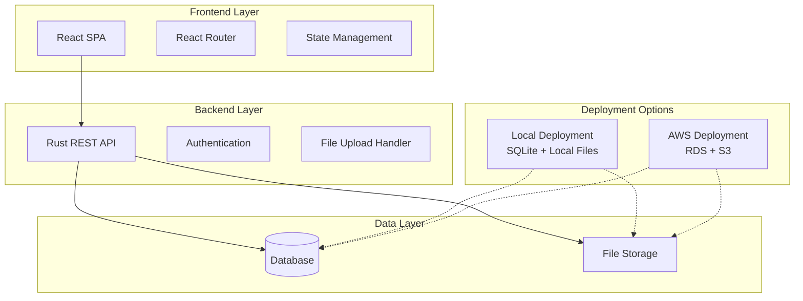
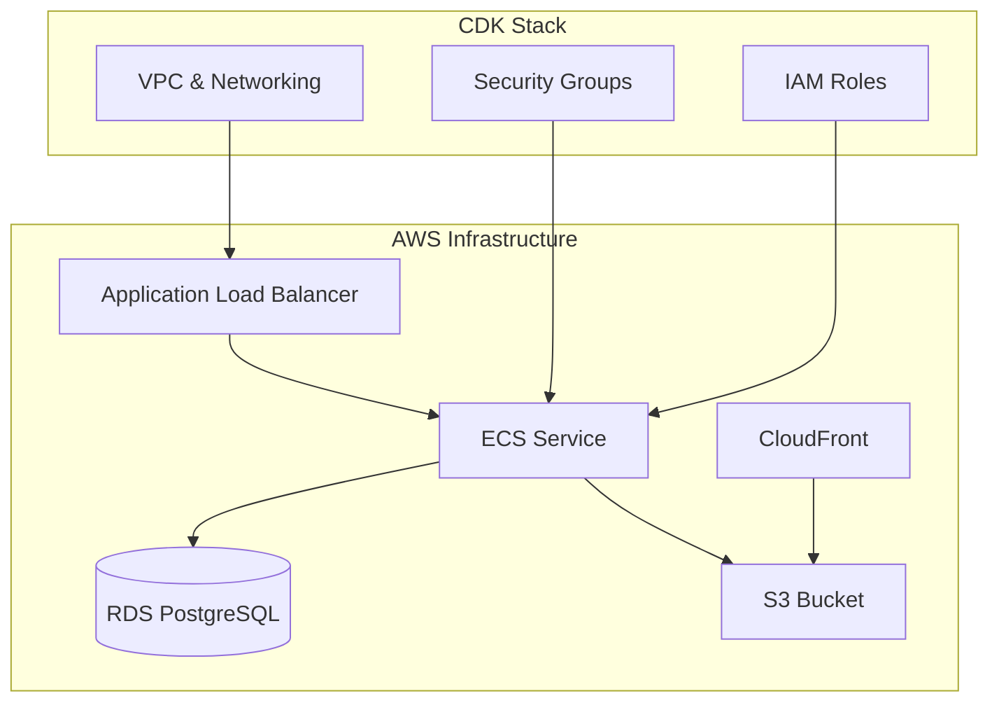

# Design Document: Miniature Painting Tracker

## Overview

The Miniature Painting Tracker is a full-stack web application designed to help Warhammer miniature painters organize and track their painting projects across multiple game systems. The application features a React frontend communicating with a Rust backend API, supported by a relational database that adapts to deployment environment (SQLite for local, PostgreSQL for AWS).

The system emphasizes simplicity, performance, and deployment flexibility while maintaining comprehensive tracking capabilities for painting progress, recipe management, and photo documentation.

## Architecture

### High-Level Architecture



### Deployment Architecture

**Local Deployment:**
- Single binary with embedded SQLite database
- Local file system for photo storage
- Minimal configuration required

**AWS Deployment:**
- Infrastructure as Code using AWS CDK (TypeScript)
- Amazon RDS (PostgreSQL) for database
- Amazon S3 for photo storage
- AWS Lambda or ECS for application hosting
- CloudFront for static asset delivery
- Application Load Balancer for traffic distribution

**Infrastructure Components:**


**Infrastructure Components:**


**Frontend:**
- React 18 with TypeScript for type safety
- React Router for navigation
- Axios for HTTP client
- Material-UI or Tailwind CSS for styling
- React Hook Form for form management

**Backend:**
- Rust with Axum web framework (chosen for modern async support and performance)
- SQLx for database operations with compile-time query checking
- Tokio for async runtime
- Serde for JSON serialization
- Tower middleware for CORS, logging, and request handling

**Database:**
- SQLite for local development and deployment
- PostgreSQL for AWS RDS deployment
- Database abstraction layer to support both engines

**File Storage:**
- Local filesystem for local deployment
- AWS S3 for cloud deployment

**Infrastructure:**
- Infrastructure as Code (IaC) using AWS CDK or Terraform for AWS deployment
- Automated provisioning of RDS, S3, and compute resources
- Environment-specific configuration management

## Components and Interfaces

### Frontend Components

**Core Components:**
- `ProjectList`: Displays projects organized by system and army
- `ProjectDetail`: Shows miniatures within a project with progress tracking
- `MiniatureCard`: Individual miniature display with photos and progress
- `RecipeManager`: CRUD operations for painting recipes
- `PhotoUpload`: Handles image upload and display
- `ProgressTracker`: Visual progress indicators and status updates

**Routing Structure:**
```
/                     - Dashboard with project overview
/projects             - Project list view
/projects/:id         - Project detail view
/miniatures/:id       - Individual miniature detail
/recipes              - Recipe management
/recipes/:id          - Recipe detail/edit
```

### Backend API Endpoints

**Project Management:**
```
GET    /api/projects              - List all projects
POST   /api/projects              - Create new project
GET    /api/projects/:id          - Get project details
PUT    /api/projects/:id          - Update project
DELETE /api/projects/:id          - Delete project
```

**Miniature Management:**
```
GET    /api/projects/:id/miniatures     - List miniatures in project
POST   /api/projects/:id/miniatures     - Add miniature to project
GET    /api/miniatures/:id              - Get miniature details
PUT    /api/miniatures/:id              - Update miniature
DELETE /api/miniatures/:id              - Delete miniature
```

**Recipe Management:**
```
GET    /api/recipes                     - List all recipes
POST   /api/recipes                     - Create new recipe
GET    /api/recipes/:id                 - Get recipe details
PUT    /api/recipes/:id                 - Update recipe
DELETE /api/recipes/:id                 - Delete recipe
GET    /api/recipes?type=troop|character - Filter recipes by type
```

**Photo Management:**
```
POST   /api/miniatures/:id/photos       - Upload photo
GET    /api/miniatures/:id/photos       - List photos for miniature
DELETE /api/photos/:id                  - Delete photo
```

### Database Schema

**Core Tables:**
```sql
-- Projects table
CREATE TABLE projects (
    id INTEGER PRIMARY KEY,
    name VARCHAR(255) NOT NULL,
    game_system VARCHAR(50) NOT NULL, -- 'age_of_sigmar', 'horus_heresy', 'warhammer_40k'
    army VARCHAR(255) NOT NULL,
    description TEXT,
    created_at TIMESTAMP DEFAULT CURRENT_TIMESTAMP,
    updated_at TIMESTAMP DEFAULT CURRENT_TIMESTAMP
);

-- Miniatures table
CREATE TABLE miniatures (
    id INTEGER PRIMARY KEY,
    project_id INTEGER NOT NULL,
    name VARCHAR(255) NOT NULL,
    miniature_type VARCHAR(20) NOT NULL, -- 'troop', 'character'
    progress_status VARCHAR(50) NOT NULL, -- 'unpainted', 'primed', 'basecoated', 'detailed', 'completed'
    notes TEXT,
    created_at TIMESTAMP DEFAULT CURRENT_TIMESTAMP,
    updated_at TIMESTAMP DEFAULT CURRENT_TIMESTAMP,
    FOREIGN KEY (project_id) REFERENCES projects(id) ON DELETE CASCADE
);

-- Painting recipes table
CREATE TABLE painting_recipes (
    id INTEGER PRIMARY KEY,
    name VARCHAR(255) NOT NULL,
    miniature_type VARCHAR(20) NOT NULL, -- 'troop', 'character'
    steps TEXT NOT NULL, -- JSON array of steps
    paints_used TEXT, -- JSON array of paint names/codes
    techniques TEXT, -- JSON array of techniques
    notes TEXT,
    created_at TIMESTAMP DEFAULT CURRENT_TIMESTAMP,
    updated_at TIMESTAMP DEFAULT CURRENT_TIMESTAMP
);

-- Photos table
CREATE TABLE photos (
    id INTEGER PRIMARY KEY,
    miniature_id INTEGER NOT NULL,
    filename VARCHAR(255) NOT NULL,
    file_path VARCHAR(500) NOT NULL,
    file_size INTEGER,
    mime_type VARCHAR(100),
    uploaded_at TIMESTAMP DEFAULT CURRENT_TIMESTAMP,
    FOREIGN KEY (miniature_id) REFERENCES miniatures(id) ON DELETE CASCADE
);
```

## Data Models

### Core Domain Models

**Project Model:**
```rust
#[derive(Debug, Serialize, Deserialize, sqlx::FromRow)]
pub struct Project {
    pub id: i64,
    pub name: String,
    pub game_system: GameSystem,
    pub army: String,
    pub description: Option<String>,
    pub created_at: chrono::DateTime<chrono::Utc>,
    pub updated_at: chrono::DateTime<chrono::Utc>,
}

#[derive(Debug, Serialize, Deserialize, sqlx::Type)]
#[sqlx(type_name = "varchar", rename_all = "snake_case")]
pub enum GameSystem {
    AgeOfSignar,
    HorusHeresy,
    Warhammer40k,
}
```

**Miniature Model:**
```rust
#[derive(Debug, Serialize, Deserialize, sqlx::FromRow)]
pub struct Miniature {
    pub id: i64,
    pub project_id: i64,
    pub name: String,
    pub miniature_type: MiniatureType,
    pub progress_status: ProgressStatus,
    pub notes: Option<String>,
    pub created_at: chrono::DateTime<chrono::Utc>,
    pub updated_at: chrono::DateTime<chrono::Utc>,
}

#[derive(Debug, Serialize, Deserialize, sqlx::Type)]
#[sqlx(type_name = "varchar", rename_all = "snake_case")]
pub enum MiniatureType {
    Troop,
    Character,
}

#[derive(Debug, Serialize, Deserialize, sqlx::Type)]
#[sqlx(type_name = "varchar", rename_all = "snake_case")]
pub enum ProgressStatus {
    Unpainted,
    Primed,
    Basecoated,
    Detailed,
    Completed,
}
```

**Recipe Model:**
```rust
#[derive(Debug, Serialize, Deserialize, sqlx::FromRow)]
pub struct PaintingRecipe {
    pub id: i64,
    pub name: String,
    pub miniature_type: MiniatureType,
    pub steps: Vec<String>,
    pub paints_used: Vec<String>,
    pub techniques: Vec<String>,
    pub notes: Option<String>,
    pub created_at: chrono::DateTime<chrono::Utc>,
    pub updated_at: chrono::DateTime<chrono::Utc>,
}
```

**Photo Model:**
```rust
#[derive(Debug, Serialize, Deserialize, sqlx::FromRow)]
pub struct Photo {
    pub id: i64,
    pub miniature_id: i64,
    pub filename: String,
    pub file_path: String,
    pub file_size: i64,
    pub mime_type: String,
    pub uploaded_at: chrono::DateTime<chrono::Utc>,
}
```

Now I need to use the prework tool to analyze the acceptance criteria before writing the correctness properties:
## Correctness Properties

*A property is a characteristic or behavior that should hold true across all valid executions of a system—essentially, a formal statement about what the system should do. Properties serve as the bridge between human-readable specifications and machine-verifiable correctness guarantees.*

### Property Reflection

After analyzing all acceptance criteria, several properties can be consolidated to eliminate redundancy:
- Project and miniature CRUD operations share similar validation patterns
- Cascade deletion properties for projects and miniatures follow the same pattern
- Input validation properties across different entities can be generalized
- Photo management and recipe management share similar CRUD patterns

### Core Properties

**Property 1: Project creation requires system and army**
*For any* project creation request, the system should accept it if and only if both game_system and army fields are provided and non-empty
**Validates: Requirements 1.1**

**Property 2: Project organization consistency**
*For any* list of projects returned by the system, they should be organized first by game_system, then by army within each system
**Validates: Requirements 1.2**

**Property 3: Project update persistence**
*For any* valid project update, querying the project immediately after the update should return the updated values
**Validates: Requirements 1.3**

**Property 4: Project cascade deletion**
*For any* project with associated miniatures and photos, deleting the project should result in all associated miniatures and their photos being removed from the system
**Validates: Requirements 1.4**

**Property 5: Miniature creation validation**
*For any* miniature creation request, the system should accept it if and only if both name and miniature_type fields are provided and non-empty
**Validates: Requirements 2.1**

**Property 6: Progress tracking with timestamps**
*For any* miniature progress update, the system should record both the new progress status and update the timestamp to reflect when the change occurred
**Validates: Requirements 2.2**

**Property 7: Miniature cascade deletion**
*For any* miniature with associated photos, deleting the miniature should result in all associated photos being removed from both database and storage
**Validates: Requirements 2.4**

**Property 8: Recipe creation validation**
*For any* recipe creation request, the system should accept it if and only if the name field is provided and non-empty
**Validates: Requirements 3.1**

**Property 9: Recipe type filtering**
*For any* recipe search filtered by miniature type, all returned results should have the specified miniature_type and no recipes of other types should be included
**Validates: Requirements 3.3**

**Property 10: Photo-miniature association**
*For any* photo upload to a miniature, querying that miniature's photos should include the uploaded photo with correct association
**Validates: Requirements 4.1**

**Property 11: Image format validation**
*For any* file upload attempt, the system should accept files with MIME types image/jpeg, image/png, or image/webp, and reject all other file types
**Validates: Requirements 4.2**

**Property 12: Photo chronological ordering**
*For any* miniature with multiple photos, the photos should be returned ordered by upload timestamp from earliest to latest
**Validates: Requirements 4.3**

**Property 13: Photo storage deletion**
*For any* photo deletion, the photo should be removed from both the database record and the underlying file storage system
**Validates: Requirements 4.4**

**Property 14: Transaction atomicity**
*For any* operation that modifies multiple related records, either all changes should be committed or all changes should be rolled back with no partial state
**Validates: Requirements 5.2**

**Property 15: Database error handling**
*For any* database connection failure, the system should return a structured error response with appropriate HTTP status code rather than crashing
**Validates: Requirements 5.3**

**Property 16: API input validation**
*For any* API endpoint, invalid input data should be rejected with appropriate error messages before any processing occurs
**Validates: Requirements 7.2**

**Property 17: HTTP status code compliance**
*For any* API response, the HTTP status code should correctly reflect the outcome (2xx for success, 4xx for client errors, 5xx for server errors)
**Validates: Requirements 7.3**

**Property 18: Structured error responses**
*For any* error condition, the API should return a consistent error response structure containing error type, message, and relevant details
**Validates: Requirements 7.4**

## Error Handling

### Error Categories

**Validation Errors (400 Bad Request):**
- Missing required fields in requests
- Invalid enum values (game system, miniature type, progress status)
- Invalid file formats for photo uploads
- Malformed JSON in request bodies

**Not Found Errors (404 Not Found):**
- Requesting non-existent projects, miniatures, recipes, or photos
- Attempting to associate photos with non-existent miniatures

**Conflict Errors (409 Conflict):**
- Attempting to create duplicate resources where uniqueness is required
- Concurrent modification conflicts

**Server Errors (500 Internal Server Error):**
- Database connection failures
- File system errors during photo operations
- Unexpected application errors

### Error Response Format

All API errors return a consistent JSON structure:
```json
{
  "error": {
    "type": "validation_error",
    "message": "Missing required field: name",
    "details": {
      "field": "name",
      "code": "required"
    },
    "timestamp": "2024-01-09T10:30:00Z"
  }
}
```

### Recovery Strategies

**Database Failures:**
- Implement connection pooling with retry logic
- Graceful degradation for read operations
- Transaction rollback for write operations

**File Storage Failures:**
- Retry mechanism for temporary failures
- Cleanup of orphaned database records if file operations fail
- Fallback to serving placeholder images for missing photos

**Concurrent Access:**
- Optimistic locking for project and miniature updates
- Clear error messages for version conflicts
- Automatic retry for transient conflicts

## Testing Strategy

### Dual Testing Approach

The system employs both unit testing and property-based testing to ensure comprehensive coverage:

**Unit Tests:**
- Verify specific examples and edge cases
- Test integration points between components
- Validate error conditions and boundary values
- Focus on concrete scenarios and known failure modes

**Property-Based Tests:**
- Verify universal properties across all inputs
- Test system behavior with randomized data
- Ensure correctness properties hold under all conditions
- Provide comprehensive input coverage through generation

### Property-Based Testing Configuration

**Framework:** [quickcheck](https://crates.io/crates/quickcheck) for Rust backend testing
**Configuration:** Minimum 100 iterations per property test
**Test Tagging:** Each property test includes a comment referencing the design property:
```rust
// Feature: miniature-painting-tracker, Property 1: Project creation requires system and army
#[quickcheck]
fn test_project_creation_validation(name: String, system: Option<GameSystem>, army: Option<String>) -> bool {
    // Test implementation
}
```

### Testing Layers

**Unit Testing:**
- Model validation logic
- Database query functions
- File upload/download handlers
- API endpoint handlers
- Business logic components

**Integration Testing:**
- Full API endpoint workflows
- Database transaction behavior
- File storage operations
- Error handling across layers

**Property-Based Testing:**
- All 18 correctness properties from the design
- Input validation across all endpoints
- Data consistency after operations
- Error handling behavior

### Test Data Management

**Database Testing:**
- Use in-memory SQLite for fast test execution
- Transaction rollback after each test
- Isolated test data per test case

**File Storage Testing:**
- Temporary directories for file operations
- Cleanup after each test
- Mock S3 operations for AWS-specific tests

**Test Generators:**
- Smart generators that produce valid domain objects
- Edge case generators for boundary testing
- Invalid input generators for error testing